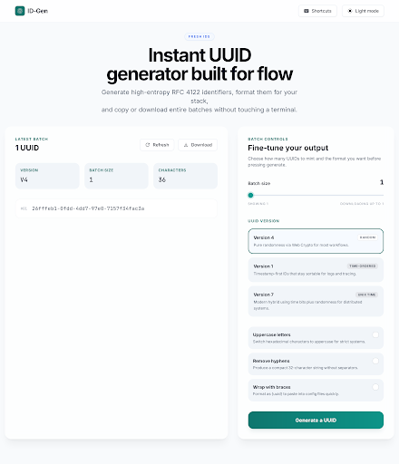

# Feature Specification: Compact Hero Section Design

**Feature Branch**: `005-enhanced-hero-design`  
**Created**: 2026-02-19  
**Status**: Implemented  
**Input**: User description: "Enhance the Hero Section for both light and dark theme as design in UUID Generator Landing Page project on Stitch. Screen name is 'Enhanced Hero Section Design'. I want to store the design file in the spec too."

## User Scenarios & Testing *(mandatory)*

### User Story 1 - View High-Impact Hero Section (Priority: P1)

As a visitor to the UUID Generator, I want to see a modern, professionally designed hero section immediately upon loading the page, so that I trust the tool's quality and understand its purpose.

**Why this priority**: The hero section is the first impression. A poor design leads to high bounce rates.

**Independent Test**: Can be tested by loading the landing page and verifying the hero section's appearance and elements.

**Acceptance Scenarios**:

1. **Given** a visitor lands on the home page, **When** the page loads, **Then** the hero section is the first visible element.
2. **Given** the hero section is visible, **When** the user reads the content, **Then** they see a clear Title ("Instant UUID generator built for flow") and Subtitle.
3. **Given** the hero section contains a visual element, **When** viewed, **Then** it conveys the concept of UUID/Security/Speed without clutter.

---

### User Story 2 - Seamless Theme Switching (Priority: P1)

As a user who prefers a specific system theme (Light or Dark), I want the hero section to look consistent and beautiful in my preferred theme, so that the experience feels native and polished.

**Why this priority**: Dark mode is a standard expectation. Inconsistent theming feels broken.

**Independent Test**: Can be tested by toggling the system or app theme preference and observing the hero section.

**Acceptance Scenarios**:

1. **Given** the application is in Light Mode, **When** the hero section is viewed, **Then** it uses the defined light color palette (high contrast, bright background).
2. **Given** the application is in Dark Mode, **When** the hero section is viewed, **Then** it uses the defined dark color palette (dark background, light text, appropriate accent adjustments).
3. **Given** the user toggles the theme, **When** the switch happens, **Then** the transition is smooth and instant.

---

### Edge Cases

- **What happens when** the viewport is strictly mobile size?
    - The design must stack vertically, ensuring text remains readable and CTA easily tappable.
- **How does system handle** extremely long translations for the title?
    - The layout should wrap text gracefully without breaking the design bounds.

## Requirements *(mandatory)*

### Functional Requirements

- **FR-001**: The hero section MUST display the main headline "Instant UUID generator built for flow".
- **FR-002**: The hero section MUST include a subheadline: "Generate high-entropy RFC 4122 identifiers, format them for your stack, and copy or download entire batches without touching a terminal."
- **FR-003**: The design MUST be implemented using the existing CSS/Styling framework (Vanilla CSS per project standards).
- **FR-004**: The component MUST fully support Light and Dark themes via CSS variables or specific classes.
- **FR-005**: The visual design MUST align with the Stitch project `projects/3811513497141801643` (UUID Generator Landing Page), screen "Compact Hero Section Design".
- **FR-006**: The hero section background MUST span the full viewport width (full-bleed), while content text remains aligned with the main page container.
- **FR-007**: The hero section background MUST NOT use any gradient effects in Light or Dark modes (flat colors only).

### Design Resources

**Stitch Project ID**: `projects/3811513497141801643`
**Target Screen Name**: "Compact Hero Section Design"
**Design Reference**:

[Design HTML](./assets/design.html) (Download to view computed styles)

**Note**: Automated design generation via Stitch is currently pending availability. Implementation should mirror the aesthetic defined in the project's existing design system or the manual design mockup if available.

## Clarifications

### Session 2026-02-20
- Q: What visual element should be used in the hero section to convey "Security/Speed"? → A: **Flat Themed Backgrounds** (Use solid hex colors defined in index.css to maintain a clean, high-contrast aesthetic without gradients).
- Q: Where should the secondary "Learn More" CTA lead? → A: **External Link** (Link to RFC 4122 spec or Wikipedia to build trust without adding internal pages).
- Q: How should the hero section background be laid out? → A: **Full-Bleed Background** (Background colors/gradients stretch edge-to-edge, content remains centered).

### Key Entities

- **ThemePreference**: User's selected theme (Light/Dark/System).

## Success Criteria *(mandatory)*

### Measurable Outcomes

- **SC-001**: Hero section renders typically in under 100ms (LCP contribution).
- **SC-002**: Passing contrast ratio (AA standard) for all text elements in both Light and Dark modes.
- **SC-003**: 100% of interactive elements (buttons) have a minimum touch target size of 44x44px on mobile.
- **SC-004**: Visual regression tests pass for both Light and Dark mode snapshots.
