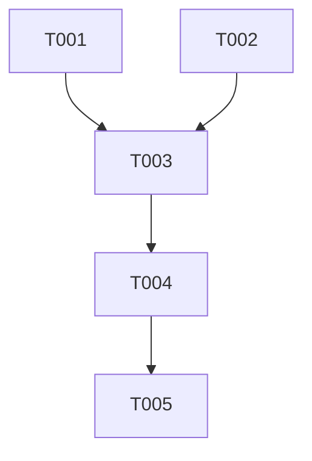

# Implementation Tasks: Fix Deployment Pipeline Vulnerability

**Feature**: Fix Deployment Pipeline Vulnerability
**Branch**: `009-fix-publish-workflow`
**Plan**: [plan.md](./plan.md)

## Implementation Strategy

1. **Foundations**: Apply the structural fix to the Dockerfile.
2. **Clean up**: Remove existing legacy workaround files related to the CVE.
3. **Validation**: Test the image locally via Trivy and validate the pipeline end-to-end.

## Phase 1: Setup

*(No foundational environment setups are required; this is a pure modification of existing pipeline assets).*

## Phase 2: User Story 1 - Deployment Pipeline Executing Without Security Failures

**Goal**: Successfully build, scan, and publish the application package without failing due to the known graphics library vulnerability.
**Independent Test**: Can be fully tested by triggering the automated deployment pipeline and verifying that the built artifact passes the security scan.

- [ ] T001 [P] [US1] Update the base image to `nginx:alpine-slim` and remove legacy `apk upgrade` commands in `/Dockerfile`
- [ ] T002 [P] [US1] Remove the `CVE-2026-25646` exemption and any other graphics library workarounds in `/.trivyignore` (or delete the file if it becomes empty)

## Phase 3: Polish & Cross-Cutting Concerns

- [ ] T003 Verify local docker build succeeds and trivy scan reports 0 critical vulnerabilities based on instructions in `/specs/009-fix-publish-workflow/quickstart.md`
- [ ] T004 Trigger the GitHub Actions automated pipeline and verify successful execution of the scan stage without `libpng` failures in `/.github/workflows/docker-publish.yml`
- [ ] T005 Update the specification status to "Implemented" and document the completion date in `/specs/009-fix-publish-workflow/spec.md`

## Dependencies

## Parallel Execution

- T001 and T002 can be implemented simultaneously modifying different aspects of the pipeline configuration.
